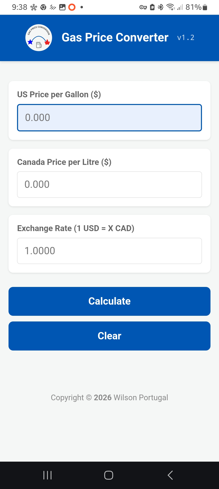

# Gas Price Converter

This project solves a recurring problem for cross-border travel: comparing fluctuating gas prices between the USA and Canada without incurring high roaming charges.

## Changes

version 1.2 - I have added functionality with a **Clear** button. I am trying to streamline the calculations.

## The Problem
> I buy gasoline in the USA once a week. The price has been fluctuating. I know the conversion between US gallon and a litre. I see the exchange rate on my credit card. I would like to be able to plug in the Canadian price and have it give me the equivalent US price, and vice versa. 

## Development Evolution

### 1. Proof of Concept (Python)
I started by creating a simple prototype in **Python** to verify the mathematical logic. You can find this original script in the `tools/` folder.

### 2. Web Prototype (HTML & JavaScript)
Next, I moved the logic to the browser using a simple web form and **JavaScript** to perform the calculations.

### 3. Mobile Optimization & PWA
To make this a "real" app, I implemented several advanced features:
*   **CSS Styling:** Used to create a thumb-friendly, mobile-first interface.
*   **Progressive Web App (PWA):** Added a `manifest.json` and a **Service Worker** to allow the app to work entirely offline (Airplane Mode).
*   **Dynamic UI:** Added JavaScript to change field colors when values are modified or calculated.

## Technical Environment
*   **Development Server:** Hosted on a **Raspberry Pi 5** within a local network.
*   **Collaboration:** Developed in collaboration with **Gemini AI**, which assisted with CSS refinement and PWA implementation.
*   **Testig:** Tested on **Android 14** using the **Chrome** browser.

## How to Use
1. Access the app via the local network IP.
2. Enter the current exchange rate from your credit card.
3. Enter either a US price (per gallon) or a Canadian price (per litre).
4. Hit **Calculate** to see the converted price.
